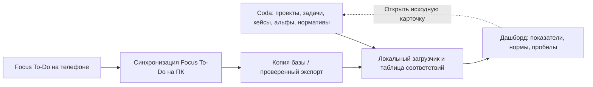

# ADR-001: связка задач, кейсов, таймера и личного дашборда

- Дата: 2026-09-28.
- Дополнено: 2026-09-29 — требования к настраиваемому таймеру непосредственно в Coda; вариант для пилота, без окончательного переключения с Focus To-Do.
- Уточнение 2026-09-29: рассматриваем кейс-менеджмент как общую модель ведения ситуаций с регулярной короткой диагностикой; кейс может существовать вне проекта.
- Статус: **рекомендуемая архитектура; интеграция ещё не реализована**.
- Подтверждённое предпочтение пользователя: Focus To-Do удобнее как повседневный таймер благодаря мобильному приложению и синхронизации с ПК; Coda удобнее для собственных карточек и шаблонов.
- Область решения: ведение ситуаций и кейсов, связанных проектов и задач, работа с альфами, регулярная диагностика, учёт времени, нормативы и показатели.
- Эта редакция расширяет первоначальный ADR об источнике часов. Наличие выгрузки не означает, что автоматическая синхронизация уже работает.

## 1. Предлагаемое решение

**Coda / Superhuman Docs — основное место ведения проектов, задач, кейсов, шаблонов и нормативов. Focus To-Do — основной таймер. Локальный дашборд — показатели, прогресс и список пробелов со ссылками на исходные карточки.**

В целевой модели кейс — самостоятельная ситуация, которую нужно понять, вести и периодически переоценивать. Карточку можно завести и начать действовать при неполной информации. Знания, план действий и состав релевантных объектов уточняются по мере работы. Проект связывает работы ради определённого результата; задача фиксирует конкретное действие; альфа позволяет проверять состояние важного объекта. Эти сущности связаны, но имеют разные назначения.

Рекомендуется сначала проверить эту модель на нескольких ситуациях, включая одну вне проекта. Полный переход всех работ на кейс-менеджмент остаётся предложением. Простая работа с известным действием может оставаться самостоятельной задачей; отдельный кейс нужен там, где полезно сохранять контекст, неопределённость, решения и историю диагностики.

Дашборд читает структуру работ из Coda и время из Focus To-Do через отдельный локальный загрузчик. Задачи связываются по постоянным идентификаторам. Для одного сеанса назначается один основной часовой норматив.

Развитие карточек, стадий, справочников и документов происходит в Coda, в том числе с помощью ИИ. Код загрузчика отвечает за чтение источников, сопоставление записей и проверку данных. Новые специфические шаблоны не требуют встроить в дашборд ещё один редактор документов или конструктор процессов.

Практический смысл подхода «документ 2.0» здесь: связанный текст, таблицы, карточки и действия в одной рабочей среде. Отдельный новый продукт с таким названием этим ADR не выбирается.

## 2. На чём основана рекомендация

### Основание и границы проверки

Рекомендация основана на требованиях владельца и локальной проверке структуры его таблиц и копии базы таймера. Публичная редакция не содержит личных записей, количеств и ссылок на частные документы.

| Источник | Проверенная структура | Вывод для решения |
| --- | --- | --- |
| Coda: проекты и работы | Стадии, приоритеты, проекты, вложенные работы, рабочие продукты, методы и кнопки учёта времени | Отделить задачи от заметок и пакетов работ; хранить блокировку отдельно от этапа |
| Coda: DB Time Entries | Начало, конец, ручная длительность, категория и задача; представления могут быть отфильтрованы | Читать базовую таблицу с полной пагинацией |
| Шаблоны кейсов и альф | Типовой объект, адаптация, состояние, свидетельство, критерий, следующий ход и обзоры | Справочник не равен заполненным экземплярам проекта |
| Focus To-Do, копия базы | Project, Task, Subtask, Pomodoro; извлечение последних версий записей проверено на одном снимке | Подтверждена возможность выгрузки, регулярная синхронизация требует отдельной проверки |
| Связи сеансов | Возможны сеансы без связанной задачи в том же снимке | Сохранять их для разбора; не угадывать проект и норматив |

Текущие плашки дашборда по-прежнему читают локальный `data/dashboard.json`. Самооценки хранятся в `data/indicators.json`. Кнопка обновления вкладки «Данные» перечитывает локальные снимки, а не синхронизирует внешние приложения.

### Сравнение вариантов

| Критерий | Только Focus To-Do | Только Coda | Coda + Focus To-Do |
| --- | --- | --- | --- |
| Быстрый таймер с телефона и ПК | Предпочтительный вариант пользователя | Уже есть кнопки учёта времени; удобство слабее по оценке пользователя | Сохраняется привычный таймер |
| Собственные карточки, кейсы и стадии | В исследованной модели нет нужной системы связных документов и настраиваемых полей | Подходящая основа уже существует | Карточки и стадии остаются в Coda |
| Альфы, подальфы, версии шаблонов и свидетельства | Потребуют внешнего слоя | Можно выразить связанными таблицами и canvas | Coda хранит модель, таймер сообщает затраченное время |
| Изменения через ИИ | Ограничены интерфейсами самого приложения | Таблицы и документы доступны через MCP; есть Docs AI | Модель меняется в Coda, загрузчик изолирует формат таймера |
| Стоимость сопровождения | Выгрузка времени плюс отдельная модель кейсов | Один источник, но нужно принять менее удобный таймер | Два источника и явная таблица связей; эту сложность принимаем ради удобства |
| Итог | Не покрывает все требования | Резервный путь, если связка окажется слишком затратной | **Рекомендуется для первого рабочего варианта** |

Оценки — архитектурный вывод из требований пользователя и проверенной структуры данных, а не результат сравнительного теста всех возможностей продуктов.

## 3. Где чем управлять

| Объект | Основное место редактирования | Что получает дашборд |
| --- | --- | --- |
| Проект, цель, стадия, рабочие продукты, блокеры | Coda | Активность, этап, ссылки, счётчики и пробелы |
| Задача и её результат | Coda | Статус, связь с кейсом и/или проектом, принадлежность к работам до эксплуатации |
| Кейс / ситуация | Общий реестр кейсов Coda с краткой карточкой и canvas для подробностей | Текущее понимание, ответственного, следующий ход, дату/сигнал возврата и ссылки |
| Короткая диагностика кейса | Журнал диагностик Coda, связанный с caseId | Дату, новые факты, открытые вопросы, принятое решение и следующую проверку |
| Типовая альфа, состояния, критерии, подсказки | Отдельный пакет справочников Coda | Требования к выбранному составу альф проекта |
| Экземпляр альфы и подальфы | Общая таблица Coda с владельцем — проектом или самостоятельным кейсом — и parentAlphaId | Заполненность, адаптацию, состояние, свидетельства и просроченные обзоры; другие кейсы ссылаются на тот же экземпляр |
| Недельный норматив | Таблица нормативов Coda в целевой схеме | План на неделю и единицу измерения |
| Фактический сеанс таймера | Focus To-Do | ID сеанса, длительность, время окончания и ссылку на задачу |
| Ручная поправка времени | Coda DB Time Entries с явным источником и причиной | Отдельную подтверждённую запись или замену конкретного сеанса |
| Снимки, связи источников и нормализованные записи | Локальный загрузчик; связи доступны для разбора | Данные для расчётов, время обновления и диагностические причины |

Кейс имеет собственный ID и необязательную связь с проектом. У проекта может быть несколько кейсов: например, согласование с клиентурой, проверка финансовой модели и подключение операторов. Бытовая ситуация или восстановление удобного распорядка также могут вестись как кейсы без создания формального проекта. Рабочий документ по шаблону — материал кейса. Ранее предложенная модель «один кейс = описание проекта» заменяется этой моделью. Таблица Issues не становится реестром кейсов только из-за своего названия.

Статус задачи в Focus To-Do не завершает автоматически карточку Coda и не подтверждает состояние альфы. Завершение таймера также не доказывает получение рабочего продукта.

### Стадии и доступность

- У проекта отдельно хранить активность: активен / пауза / закрыт; отдельно этап: подготовка / создание / ввод / эксплуатация.
- Для кейса в пилоте использовать состояния «новый / в работе / наблюдение или ожидание / закрыт» с возможностью повторного открытия. Срочность, степень неопределённости и дата следующей проверки — отдельные характеристики. «Наблюдение» требует условия или даты возврата; закрытие требует результата и основания, а не только закрытых задач.
- У работы хранить вид строки: задача / пакет работ / заметка; отдельно состояние выполнения, блокировку и признак «требуется до эксплуатации». Справочники можно менять в Coda.
- У альфы сохранять состояния именно её шаблона, а также свидетельство и дату проверки. Чекбокс выполненной задачи не заменяет эту оценку.
- Coda подходит для редактирования карточек в вебе и мобильном приложении. По официальной справке изменение формул, форматов колонок и представлений ограничено на мобильном; структуру дорабатывать с компьютера. Для открытия документа нужна сеть; уже открытый документ допускает работу при потере связи.
- Focus To-Do предоставляет мобильные и настольные приложения и синхронизацию. Факт появления конкретного мобильного сеанса в локальной Windows-базе нужно проверить в пилоте.
- Текущий дашборд доступен только на этом ПК через `127.0.0.1`. Это не адрес для телефона. Работа в Coda и Focus To-Do с телефона не должна зависеть от включённого ПК; при выключенном ПК откладывается только локальное обновление показателей.
- Доступ к самому дашборду с других устройств — отдельная задача размещения и доступа. Он не появляется автоматически благодаря синхронизации Focus To-Do.

## 4. Как связать карточку и таймер

1. У задачи Coda сохраняется её постоянный row ID. Дополнительно можно показывать короткий ключ, например `W-0042`.
2. В Focus To-Do для текущей работы достаточно короткого названия с этим ключом и ссылки на карточку в заметке. Полный кейс и его стадии там не дублируются.
3. После первой сверки хранится соответствие `focusTaskId → codaTaskRowId`. Переименование не разрывает связь. Несколько задач таймера могут ссылаться на одну карточку Coda; один сеанс относится только к одной работе.
4. Кейс, необязательный проект и часовой норматив определяются по подтверждённой карточке и карте типов работ. Для самостоятельного кейса projectId может отсутствовать. Нечёткое совпадение названий может предложить связь, но не создаёт её самостоятельно.
5. Для исторического сеанса сохраняются категория, caseId и проект при наличии, использованные при учёте. Последующее изменение текущей карточки не переносит прошлые часы между направлениями молча.
6. Если карточка относится к нескольким проектам, для времени требуется один основной проект либо явное распределение долей с суммой 100%. Полная длительность не приписывается каждому проекту.
7. Независимые нормативы чтения 10 ч, руководств и проекта 10 ч, наставника 3 ч сохраняются. Признаки «писал кейс» и «диагностика кейса» дополняют основной норматив как вид работы, но не создают вторую копию тех же часов. Время бытовой или деловой диагностики не относится автоматически к руководствам.

Для диагностики без отдельной задачи Coda допускается явное соответствие `focusTaskId → caseId` с видом работы «диагностика». Запись обзора ссылается на ID сеанса. Если один общий пункт Focus To-Do используется для разных кейсов, связь назначается конкретному сеансу при разборе; по одному общему названию кейс не угадывается. В нормализованной записи taskRef и projectRef могут отсутствовать, когда указан самостоятельный caseRef и норматив.

## 5. Кнопка в Coda: что возможно

**Кнопка может изменить строку, создать запрос на действие или вызвать внешний API через Pack. Произвольная команда Windows из документа напрямую не запускается.**

| Вариант | Что делает | Ограничение / решение |
| --- | --- | --- |
| Кнопка со ссылкой | Открывает карточку или поддерживаемую ссылку приложения | Для запуска конкретного таймера необходим подтверждённый URI/deep link Focus To-Do на каждой нужной платформе |
| Pack action | Отправляет поля задачи в HTTPS API и получает результат | Выполняется через инфраструктуру Coda; адрес `127.0.0.1:8787` пользователя для неё недоступен |
| Кнопка → таблица запросов → локальный обработчик | Coda записывает ID задачи и действие; обработчик на ПК сам забирает запрос через API | Подходит для локальной схемы без входящего публичного сервера. При выключенном ПК запрос ожидает |
| Собственный обработчик ссылок Windows | По нажатию открывает разрешённую локальную операцию | Требует установки на ПК и отдельной реализации для телефона; для первого варианта избыточен |

В манифесте установленной Windows-версии Focus To-Do 7.2.2.0 не найдено расширения `windows.protocol`. В проверенных официальных материалах не найден документированный API старта таймера. Это ограниченный результат проверки, а не доказательство отсутствия всех возможных интеграций.

**Первый вариант:** вручную запускать привычный Focus To-Do, связывая активные задачи по ID. Кнопку Coda «Подготовить фокус» рассматривать как отдельное улучшение: она может записать выбранную работу в очередь и подготовить название и ссылку. Она не должна называться «Таймер запущен», пока запуск не подтверждён самим приложением.

Для будущей очереди достаточно `requestId, taskRef, action, requestedAt, expiresAt, status, result`. Нужны известные действия вместо произвольного текста команды, обработка одного ID один раз и состояния «ожидает ПК / выполнено / нужен ручной запуск / ошибка / истёк срок». Просроченный запрос не должен неожиданно запускать работу после включения компьютера. Команда на ПК также не означает запуск таймера на телефоне.

Автоматическое создание задачи и старт/стоп Focus To-Do остаются техническим экспериментом. Если подходящего интерфейса нет, ручной старт остаётся рабочим; интеграция показателей от него не зависит.

### 5.1. Альтернатива для пилота: настраиваемый таймер в Coda

Проверить возможность вести сеанс прямо в карточке задачи или кейса Coda: выбрать норматив и режим, нажать «Старт», работать, завершить сеанс и записать результат. Основа уже есть в кнопках «Начать фокус / Завершить фокус» и DB Time Entries. Настраиваемые режимы, паузы и остальные функции ниже — требования к доработке, а не уже реализованные возможности документа.

| Настройка | Требование |
| --- | --- |
| Длительность рабочего интервала | Изменяемое число минут: например 15, 25, 45, 50 или своё положительное значение |
| Короткий перерыв | Изменяемая длительность, например 5 или 10 минут |
| Длинный перерыв | Изменяемая длительность, например 15 или 30 минут |
| Цикл | Настраиваемое число завершённых помидорок до длинного перерыва, например 4 |
| Пресеты | «25/5», «50/10», «Свой»; общие настройки с возможностью выбрать другой режим для конкретной задачи |
| Способ отсчёта | Обратный отсчёт до цели или секундомер без ограничения |
| Управление | «Старт», «Пауза», «Продолжить», «Завершить», «+5 минут»; возможность пропустить перерыв |

**Правила времени и истории:**

- При старте сохранять ID сеанса, задачу, проект, норматив и снимок настроек: режим, плановую длительность и параметры перерывов. Изменение пресета применяется к следующим сеансам; прошлые записи сохраняют свои значения.
- «+5 минут» явно продлевает план текущего сеанса и сохраняет факт изменения. Продление плана само по себе не добавляет пять минут в норматив.
- Пауза закрывает текущий рабочий интервал; продолжение открывает новый интервал того же сеанса. В итог входят записанные рабочие интервалы. Паузы и перерывы сохраняются отдельно и исключаются из рабочих часов.
- Досрочно завершённый сеанс может дать фактически учтённое время, но не автоматически полный помидор. Количество завершённых помидорок и сумма рабочих минут — отдельные показатели.
- Пример: два сеанса по 15 минут и один по 50 минут дают 80 минут работы. Пересчёт через «число помидорок × текущий размер помидорки» не используется.
- Хранить моменты старта, паузы, продолжения и завершения. Формула текущего времени нужна для отображения; в историю не записывать отдельную строку каждую секунду.
- После закрытия и повторного открытия страницы восстанавливать отсчёт по сохранённым отметкам. Само истечение запланированных 25 минут не доказывает, что работа закончилась или продолжалась всё это время. Забытый открытый сеанс показывать для подтверждения и исправления.
- Для одного пользователя допускать один активный рабочий сеанс. Повторное нажатие и синхронизация между устройствами не должны создавать второй интервал.

**Мобильный сценарий и сигнал:** начинать и заканчивать сеанс из карточки Coda на телефоне или ПК после синхронизации документа. Учёт времени в Coda не требует включённого локального сервера дашборда. Удобство кнопок и перенос активного сеанса между устройствами проверить в пилоте.

Обратный отсчёт через кнопки и формулы описан в [официальном примере Coda](https://help.coda.io/hc/en-us/articles/39555941961229-Adding-formulas-to-buttons). Надёжный звуковой или push-сигнал точно по окончании интервала при закрытом приложении или заблокированном телефоне не считать обеспеченным: изменения формул не запускают автоматизацию, а стандартная периодическая автоматизация имеет минимальный часовой шаг. Для такого сигнала потребуется отдельно проверенный внешний механизм. [Документация автоматизаций](https://help.coda.io/hc/en-us/articles/39555778179853-Automations-in-Coda).

**Проверка перед выбором:** на одной карточке испытать разные длительности, паузу и продолжение, продление, закрытие страницы, старт на телефоне и завершение на ПК, а также сохранность прошлых сеансов после изменения пресета. Сверить рабочие минуты с журналом интервалов. По результатам сравнить удобство с Focus To-Do и определить, обязателен ли фоновый сигнал.

При успешном пилоте можно выбрать Coda основным источником новых сеансов: связь с задачей и нормативом тогда существует сразу, загрузчик дашборда читает завершённые записи из Coda. Переход фиксируется отдельным решением с датой; одновременно суммировать дублирующие сеансы Coda и Focus To-Do нельзя. До такого выбора рекомендации по связке с Focus To-Do в остальных разделах сохраняются.

## 6. Кейс, шаблон и измеримые поля

### Короткий цикл ведения ситуации

**Замеченная ситуация → предварительная картина → короткая диагностика → следующий ход или осознанное наблюдение → новый факт / дата возврата → повторная диагностика.**

Для создания кейса достаточно описать ситуацию и почему она требует внимания, назначить ведущего и указать ближайшую проверку или действие. Неполное понимание допустимо: неизвестное отмечается явно. Подробный шаблон и альфы подключаются по мере необходимости; их незаполненность не блокирует первый полезный шаг.

Предлагаемый предел быстрой диагностики в пилоте — 3–5 минут; это проверяемая настройка процесса, а не утверждённый норматив. Если вопрос требует исследования, результат диагностики — отдельная задача на исследование с ожидаемым свидетельством. Проверка включает:

1. Что изменилось с прошлого раза? Какие наблюдения и свидетельства есть сейчас?
2. Что считаем фактом, что — гипотезой, чего ещё не знаем? Какой пробел может повлиять на ближайшее решение?
3. Какие 1–3 объекта или аспекта сейчас важно проверить? При необходимости использовать подсказки альф и контрольных вопросов.
4. Какой следующий ход даст результат или уменьшит значимую неопределённость? Кто его выполняет? Допустимо осознанно оставить ситуацию под наблюдением, указав причину.
5. Когда или при каком событии вернуться? Для ожидания события задавать также контрольную дату, чтобы кейс не исчез из внимания.

Результат записывается отдельной строкой журнала: caseId, время, наблюдения/свидетельства, гипотезы и открытые вопросы, решение, следующее действие либо условие наблюдения, дата следующей проверки. Старые выводы сохраняются, новые могут их пересматривать. Запись «существенных изменений нет» допустима, если понятно, что проверили и почему выбран следующий срок. Одно открытие карточки не считается диагностикой.

Частоту назначать по изменчивости ситуации и последствиям пропуска. Для быстро меняющегося кейса может требоваться ежедневная проверка; для стабильного наблюдения — более редкая. Новый ответ участника, изменение сроков, конфликт свидетельств или неудача действия могут потребовать внепланового обзора. В пилоте достаточно списка «На проверку сегодня» и поля следующей даты; автоматические уведомления и правила обработки событий ещё не реализованы.

Регулярная диагностика проверяет как проблемы, так и то, что пока работает. Заполнение карточки не доказывает благополучие ситуации. Закрытие допустимо при достигнутом результате, подтверждённой утрате актуальности или явном решении прекратить ведение; причины различаются. При новом существенном факте кейс можно открыть снова с сохранением истории.

### Шаблоны и альфы

В карточке кейса размещается текст по выбранному шаблону и связанные представления задач, диагностик и объектов. В проекте показываются его кейсы. Пакет шаблона хранится отдельно: версия, типовые альфы, состояния, вопросы, роли, пояснения. Шаблоны разных типов ситуаций могут отличаться; общего короткого цикла достаточно для начала.

Для проекта или самостоятельного кейса выбирается применимый набор альф. Экземпляр альфы содержит:

| Группа | Поля |
| --- | --- |
| Связи | ID экземпляра, ownerType и ownerId (проект или кейс), templateAlphaId, templateVersion, parentAlphaId, зона; связи с другими кейсами |
| Адаптация | Типовое имя, проектное имя, описание конкретного объекта, подтверждение адаптации |
| Проверка | Применимость и причина исключения, текущее состояние, ожидаемое состояние, критерий, свидетельство |
| Ведение | Ответственный, следующий ход или причина его отсутствия, дата следующего обзора, createdAt, filledAt, reviewedAt |

Для критериев каждого состояния использовать справочник шаблона. Общие поля не подменяют специфические вопросы методики.

В каждом кейсе показывать представление общей таблицы по связям с этим кейсом. Если несколько кейсов затрагивают одну альфу проекта, они ссылаются на один экземпляр: объект и его состояние не размножаются по числу карточек. Альфа самостоятельного кейса имеет собственную область владения. Coda поддерживает canvas-шаблоны и связанные представления; копирование базовой таблицы создаёт отдельные несвязанные таблицы, поэтому способ копирования нужно задать явно.

Версия шаблона фиксируется в проекте или кейсе. Обновление справочника не перезаписывает адаптацию существующих объектов; миграция состава и критериев выполняется отдельно. ИИ может предложить гипотезу, название, поля, связи, вопросы для диагностики и следующий ход. Автор и основание предложения сохраняются; заполненный ИИ черновик не становится автоматически подтверждённым состоянием.

## 7. Что именно считать

| Показатель | Правило |
| --- | --- |
| Часы по нормативу | Сумма подтверждённых длительностей за период по одному metricId; прогресс = часы / норматив |
| Кейсы в работе и под наблюдением | Число уникальных caseId по соответствующим состояниям; проект для включения не обязателен |
| Требуют первичной диагностики | Незакрытые кейсы без сохранённой содержательной диагностики |
| Просрочена диагностика | Незакрытые кейсы с прошедшей nextReviewAt; отсутствие даты показывается отдельным пробелом и не считается своевременным обзором |
| Нет следующего хода | Незакрытые кейсы без назначенного действия и без явно выбранного наблюдения с условием/контрольной датой |
| Открытые вопросы без проверки | Существенные для ближайшего решения неизвестные, для которых не назначен способ проверки или обоснование наблюдения |
| Актуальность картины | Дата последней диагностики, следующая дата и отмеченные новые события; давняя проверка не становится актуальной из-за редактирования оформления |
| Проекты созданы за период | Число различных projectId с датой создания в периоде; это не текущий активный портфель |
| Активные проекты | Число различных projectId со статусом «активен» на дату снимка |
| Проекты, которые веду | Активные проекты, по которым в выбранном периоде сохранён содержательный обзор проекта или связанного кейса с результатом и следующей датой/действием; один projectId считается один раз. Обзор одного кейса не доказывает охват всех зон проекта |
| Открытые задачи до эксплуатации | Незавершённые и неотменённые строки вида «задача» с этим признаком в активных проектах; ввод проекта в эксплуатацию сам их не закрывает |
| Заполнено альф за неделю | Число уникальных экземпляров, впервые достигших требований заполнения в неделю; повторное редактирование и повторный импорт не увеличивают счётчик |
| Заполненность кейса альфами | Количество заполненных применимых обязательных слотов / количество применимых обязательных слотов × 100% |
| Проектное именование | Слоты с конкретным непустым именем, отличным от типового после нормализации регистра и пробелов, / применимые обязательные слоты × 100% |
| Подтверждённая адаптация | Слоты с проектным именем, описанием конкретного объекта и подтверждённой адаптацией / тот же состав слотов × 100% |
| Охват зон | Зоны с заполненными обязательными объектами / применимые зоны; рядом — список отсутствующих объектов |
| Состояние и актуальность | Доля объектов с проверенным состоянием, критерием и свидетельством; отдельно объекты с просроченной датой следующего обзора |

Для диагностики основной вид дашборда — очередь внимания: новые кейсы, просроченные проверки, существенные вопросы без проверки и отсутствие следующего хода. Число диагностик, закрытий и процент заполнения помогают оценить практику ведения, но сами по себе не измеряют успех разрешения ситуации. Не вводить норматив «закрыть больше кейсов» без определения нужного результата.

Состав обязательных слотов фиксируется выбранной версией шаблона и явным объёмом проверки проекта или кейса. Его изменение сохраняется в истории. Знаменатель не ограничивается уже созданными заполненными карточками: отсутствующий обязательный слот тоже входит в него. «Не применяется» исключает слот только с объяснением. Если состав ещё не задан, процент — `No Data`; короткая диагностика при этом доступна. Заполненность выбранных объектов одного кейса не выдаётся за полноту всего проекта. В общих счётчиках один alphaId считается один раз, даже если он связан с несколькими кейсами.

Для минимальной заполненности слота нужны идентификация конкретного объекта в проекте или кейсе, описание, явно указанное состояние, критерий проверки и следующий ход либо объяснение его отсутствия. Свидетельство требуется для подтверждения состояния. Состояние «не проверено» допустимо в заполненной карточке и остаётся пробелом проверки.

Проектное имя — полезный формальный сигнал; оно не доказывает содержательную адаптацию. Поэтому процент именования и подтверждённой адаптации различаются. Подальфы имеют собственные ID. Верхние альфы и подальфы показываются раздельно; их бесконтрольное добавление не должно улучшать процент охвата верхнего уровня.

Сеанс работы над кейсом связывается с задачей или обзором, caseId, необязательным projectId и затронутыми альфами. Для короткой диагностики не обязательно создавать отдельную задачу. Несколько альф в одном сеансе не умножают длительность. Запись обзора ссылается на сеанс Focus To-Do, когда он доступен; его длительность не добавляется второй раз как ручное время. Работа с кейсом не ограничивается заполнением текста: учитывается также проверка ситуации и принятые действия.

Пример: непроверенная потребность клиентов, финансовая модель без проверки допущений и отсутствие договорённостей с операторами становятся тремя пробелами с ответственным и следующим ходом. Заполненное название карточки не закрывает их автоматически.

## 8. Контракт загрузки и качество данных

- **Владение временем:** Focus To-Do — основной источник новых таймерных сеансов. Coda DB Time Entries — ручной резерв и отдельно проверенная история. Два одновременно работающих таймера для одной работы не суммируются.
- **Идентификатор:** уникальная пара `source + externalId`. Повторный импорт не меняет итог. Поправки обновляют существующую запись с журналом изменений, а не добавляют вторую.
- **Пересечения:** совпадение задачи и времени даёт кандидата в дубль. Исключение/замена подтверждается явной связью. Ручная поправка содержит `replacesEntryId` либо является новым непересекающимся интервалом.
- **Даты Focus:** в выгрузке имеются `endDate` и `interval`; фактическое начало с учётом пауз не подтверждено. До проверки распределять длительность на локальную дату окончания с пометкой `allocationMethod=end_date`. Вычитание interval из endDate не выдавать за измеренное начало. Длинные сеансы и попадание около границ суток/недели проверять отдельно.
- **Даты Coda:** использовать завершённый интервал; работающий таймер не включать как окончательный факт. В ранней проверке были пустые категории и длительности порядка суток, поэтому требуется разбор аномалий. При подтверждённых начале и конце распределять по границам дней в Asia/Tashkent.
- **Классификация:** у каждой засчитанной записи есть явные metricId и связь с кейсом, задачей или проектом либо подтверждённая самостоятельная категория. Неопределённая категория остаётся в «Требует разбора».
- **Сырые данные:** сохранять снимки без изменений. Читать Focus из копии; не редактировать IndexedDB установленного приложения. Для регулярной загрузки подтвердить согласованность снимка и обновление после синхронизации с телефона.
- **Coda:** читать базовые таблицы по ID с полной пагинацией. Отсутствие строки в ограниченном представлении не означает удаление. Переименование колонки не должно ломать контракт; изменение типа должно давать видимую ошибку.
- **Свежесть:** отдельно показывать момент получения локального снимка и известную дату данных источника. Выключенный ПК и неуспешная синхронизация не превращаются в ноль.
- **Отсутствие данных:** `No Data` при неизвестном факте/плане/знаменателе. Ноль допустим только при подтверждённой полноте соответствующего набора. При сбое сохраняется последний успешный результат с пометкой о давности.
- **Нормативы:** отдельная запись на неделю и показатель; новая цель не переписывает прошлые недели. Альфы, часы и самооценки не складываются между собой.
- **Financial flow:** время по бизнесу и продаже дома не превращается в денежные поступления; до появления сумм остаётся `No Data`.

В текущем локальном API реализовано только предотвращение повторного добавления одинаковой пары source/externalId. Обновления, удаления, распределение и проверки из этого раздела — требования к будущему загрузчику.

### Что подготовить в существующей Coda

1. Разделить вид строки, стадию работы и состояние блокировки/архива.
2. Подготовить общий реестр кейсов и журнал коротких диагностик. Назначить постоянные связи caseId, необязательного проекта, задач и альф; привести типы ссылок к единой схеме.
3. Проверить таймерные формулы: `Current entry` сейчас ищет по Work Capacity, а кнопка остановки — по конкретной задаче. В резервном сценарии искать текущий сеанс по задаче.
4. Проверить кнопку старта: `Activity name` имеет тип ссылки на работу, а в действие передаётся значение текстового `Проект/Пакет работ`. Оставить одну каноническую ссылку `Карточка задачи` и проверить перенос категории.
5. Настроить страницу «Сегодня» для телефона: кейсы на диагностику, следующий ход, текущая задача и необязательный проект. Действие «Диагностика» сохраняет результат обзора и следующую дату; подробные справочники открываются по необходимости.
6. После сверки существующих локальных карточек выбрать для каждой перенос в Coda или архив; не поддерживать два независимых редактируемых экземпляра одного проекта.

## 9. Последовательность реализации и критерии пересмотра

1. **Рабочая модель.** Несколько реальных ситуаций: одна внутри проекта, одна бытовая/личная вне проекта и одна под наблюдением. Проверить создание при неполной информации, диагностику за 3–5 минут, назначение следующего хода, возврат по дате и повторное открытие. Альфы добавлять по необходимости. Затем решить, расширять ли кейс-менеджмент на остальные работы.
2. **Связь с таймером.** Связать несколько задач Focus To-Do с Coda по ID. Сверить 10–20 сеансов: мобильный запуск, появление на ПК, длительность, задача и категория. Проверить ручной сеанс и переход суток.
3. **Показатели.** Подключить чтение Coda и проверенный импорт Focus в отдельном загрузчике. Проверить очередь диагностики, кейс без проекта, просроченный обзор и отсутствие следующего хода. Повторный импорт, переименование задачи и исправление длительности не должны удваивать факт. Недельные суммы сверить с приложением.
4. **Шаблоны и альфы.** Подключить реестр экземпляров и историю обзоров; проверить отсутствие обязательного слота, подальфу, обоснованное «не применяется» и обновление версии шаблона.
5. **Кнопка.** После проверки интерфейса Focus выбрать: ручной запуск с подготовленным контекстом либо подтверждённый программный старт. При необходимости добавить очередь запросов Coda и локальный обработчик.
6. **Портфель.** После пилота расширить схему на подходящие ситуации и проекты; для общего прогресса использовать уникальные слоты и их знаменатели, не усреднять проценты проектов с разным составом и не повторять общие альфы нескольких кейсов.

Предлагаемый период проверки удобства — одна рабочая неделя. Пересмотреть выбор таймера, если связь требует постоянного двойного ввода, мобильные сеансы ненадёжно попадают на ПК или чтение базы ломается после обновлений. В этом случае первым резервом служит уже имеющийся таймер Coda. Если обязательным требованием станет запуск конкретной задачи одним нажатием на всех устройствах, выбирать таймер с документированным интерфейсом интеграции; Coda и модель кейсов при этом сохраняются.

## Источники и границы проверки

- Уточнение пользователя от 29.09.2026: рассматривать кейсы как ситуации с неполной картиной, требующие регулярной быстрой диагностики. Предложенные 3–5 минут и состояния кейса — параметры пилота, ещё не подтверждённые практикой.
- [OMG: Case Management Model and Notation](https://www.omg.org/cmmn/) — концептуальная опора для ведения изменяющихся ситуаций, где порядок действий уточняется по новым данным. Внедрение движка или полного стандарта CMMN не входит в это решение.
- [Focus To-Do: платформы и функции](https://www.focustodo.cn/).
- [Coda на мобильных устройствах](https://help.coda.io/hc/en-us/articles/39555863271053-Coda-mobile-app-basics).
- [Canvas и шаблоны строк](https://help.coda.io/hc/en-us/articles/39555806187917-Canvas-column-type).
- [Связанные представления](https://help.coda.io/hc/en-us/articles/39555897467021-Create-connected-table-views).
- [MCP: изменение документов и таблиц через ИИ](https://help.coda.io/hc/en-us/articles/44722756780173-Using-the-Coda-MCP).
- [Coda API](https://coda.io/developers/apis/v1), [действия Pack](https://coda.io/packs/build/latest/guides/blocks/actions/) и [HTTPS-запросы Pack](https://head.coda.io/packs/build/latest/guides/basics/fetcher/).
- Локальная проверка: Excel-выгрузка Focus To-Do; AppxManifest.xml установленной версии 7.2.2.0. В манифесте найдены расширения уведомлений и COM, расширение URL-протокола не найдено.

Текущая работа фиксирует архитектуру и критерии внедрения. Она не создаёт новый автоматический обмен, не меняет исходные таблицы Coda и не реализует команду старта Focus To-Do.
