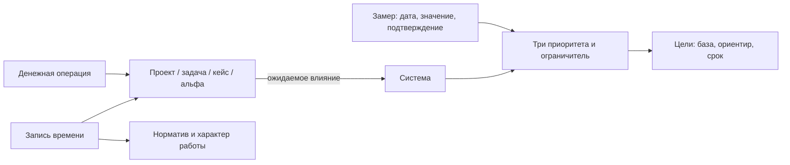

# ADR-002: нормы, работы и характеристики систем

- Дата: 2026-09-29.
- Статус: первый локальный вариант, версия 1.1.
- Контекст: выполнять нормы, видеть остальное время и характер работ, измерять цели и изменения систем, подключать финансовые выгрузки.
- Связано с [ADR-001](ADR-001-time-sources.md): целевая связка Coda и Focus To-Do.

## Решение

Время, выполненная работа и измеренный результат хранятся отдельно. Закрытие задачи не создаёт замер характеристики. Затраченные часы не доказывают достижение цели.

## Время и нормы

| Группа | Правило |
| --- | --- |
| По заданным нормативам | У направления есть положительный план на неделю записи |
| Направление без норматива | Направление выбрано, недельный план отсутствует |
| Вне нормативов | Явный выбор пользователя; ни один норматив не выполняется этим временем |
| Не разобрано | Назначение учтённого времени ещё неизвестно |

Характер работы — отдельный разрез: создание, изменение, эксплуатация, поддержка, исследование, обучение, переговоры, организация, быт, отдых или своё название. Старым записям характер не приписывается автоматически. Отдых не объявляется потерей времени.

Детализация показывает дату, название, часы, направление, характер и связь с работой. При переклассификации прежние поля сохраняются в `classificationHistory`; длительность не меняется. Альфы не складываются с часами. Общее время включает часы вне нормативов, прогресс каждой нормы — только её записи.

Быстрые периоды относятся к фактическим часам и деньгам. У нормативов отдельный выбор недели. Разрез по нормам использует сохранённый план недели записи: изменение этого плана меняет соответствующий разрез. Полнота суток неизвестна; незаписанное время не вычисляется как «24 часа минус записи».

## Системы и влияние работ

Система содержит три приоритетные характеристики и как минимум один ограничитель. Поля приоритета: название, единица, исходная база, ориентир, направление «увеличить / уменьшить». Ограничитель задаёт верхний допустимый предел. Пустые поля остаются `No Data`, поэтому начать работу можно до завершения диагностики.

Факт берётся из последнего по дате замера. Обязательны значение, дата не в будущем и подтверждение; связанная работа необязательна. Более поздняя запись на ту же дату уточняет текущий факт, сохраняя историю. Дата замера видна; автоматической проверки его устаревания пока нет.

Процент продвижения приоритета: `(факт − база) / (цель − база)`, от 0 до 100%. При неизвестной базе, факте или цели процент — `No Data`. Если база равна цели, показывается достижение по порогу без процента. Нулевое значение допустимо. Для ограничителя проверяется `факт <= предел`; превышение выделяется отдельно.

Проект, задача, кейс и альфа могут связаться с системой и описать ожидаемый вклад по её характеристикам. Задача, кейс или альфа без собственной связи использует систему проекта. Вклад проекта не выдаётся за ожидаемый вклад отдельной задачи. Общие замеры системы видны на связанных карточках без копирования. В первой версии у объекта одна собственная система; работа над несколькими системами потребует расширения.

Единицу и смысл характеристики с замерами нельзя менять так, чтобы старые числа получили новое значение. В первой версии для другой шкалы создаётся новая система. Изменение базы или цели меняет текущую оценку; исходные замеры сохраняются. Связь замера с работой фиксирует контекст, а не доказывает причинность.

## Цели и кейсы

Цель: название, база, ориентир, направление, единица, срок, статус, необязательная связанная работа. Факт берётся из собственных замеров либо из характеристики системы. У цели может быть свой ориентир при общем измеряемом факте. Процент не вычисляется по количеству закрытых задач.

Кейс может существовать без проекта. Он хранит контекст, состояние, следующий ход, дату возврата и результат закрытия. Короткая диагностика сохраняет факты, неизвестное, следующий ход и дату проверки отдельной записью. Для закрытия нужно основание. В обзоре видны кейсы без диагностики, просроченный возврат и отсутствие следующего хода. Автоматических уведомлений пока нет.

## Деньги

Доступны ручные операции и канонический CSV с предварительной проверкой. Поля операции: дата, положительная сумма до двух знаков после запятой, трёхбуквенная валюта, тип `income / expense / transfer`, категория, описание, необязательная связанная работа. Сумма хранится целым числом сотых долей. Валюты считаются отдельно; пересчёта по курсу нет.

CSV в UTF-8: `externalId,date,amount,currency,type,category,description`. Обязательны первые пять колонок. Дата — YYYY-MM-DD. Разделитель — запятая или точка с запятой. У операции должен быть устойчивый ID приложения; имя источника должно сохраняться между импортами.

- Сначала проверяется весь файл и показываются новые строки, повторы и ошибки.
- Ошибочная строка отменяет запись всего набора.
- Одинаковая пара `source + externalId` не удваивает деньги.
- Совпавший ID с отличающимися полями требует сверки; импорт не переписывает историю.
- Исправление через интерфейс сохраняет прежнее значение в `revisions`.
- Переводы между своими счетами исключаются из дохода, расхода и чистого потока.
- Суммы — поток по загруженным операциям, а не банковский остаток. Категории не угадываются.

Выбранный файл не изменяется; его следует хранить вместе с резервной копией. Адаптер конкретного мобильного приложения будет добавлен после получения образца выгрузки. Без устойчивых ID потребуется отдельно согласованное сопоставление операций. Автоматического чтения телефона пока нет.

## Хранение и границы пилота

| Файл | Данные |
| --- | --- |
| `data/dashboard.json` | Нормативы, время, локальные проекты, задачи, альфы |
| `data/workspace.json` | Системы, цели, кейсы, связи, замеры, диагностики, деньги, журнал импортов |
| `data/indicators.json`, `data/indicator-ratings.csv` | Субъективные самооценки |

В пилоте новые данные редактируются локально. Это уточнение ADR-001: перенос владения карточками в Coda потребует сопоставления ID и миграции. Двусторонней синхронизации нет. Конструктор документов и процессов не внедряется; шаблоны остаются отдельным пакетом.

Сервер слушает `127.0.0.1`. Доступ с телефона к самому дашборду и автоматический импорт Focus To-Do ещё не подключены. `DASHBOARD_DATA_DIR` задаёт каталог данных, `DASHBOARD_PORT` — порт. Один каталог обслуживается одним процессом. Резервная копия — весь каталог при остановленном сервере. В Git попадают только исходники.

## Проверка и следующий шаг

Проверяются независимость времени и альф, переклассификация, общий замер для системы и цели, превышение ограничителя, кейс без проекта, история диагностик, разные валюты, переводы, атомарность и повторный импорт. Интерфейс проверяется на отдельном тестовом каталоге.

Практический следующий шаг: выбрать три реальные характеристики личной рабочей системы и ограничитель; задать единицы, базу и ориентиры. Затем записать несколько обычных работ и один замер. По результату подключать выгрузки таймера и финансовых приложений.
